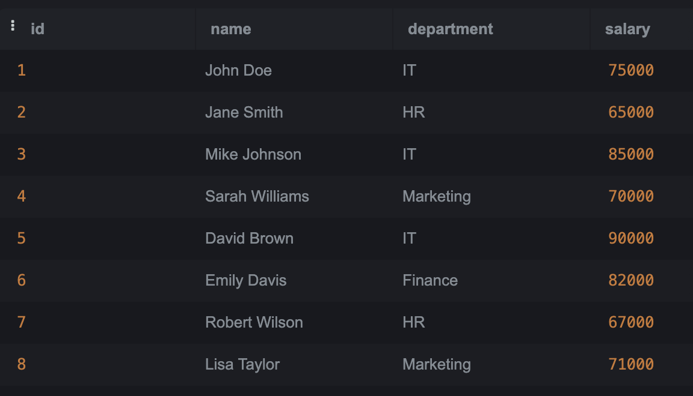
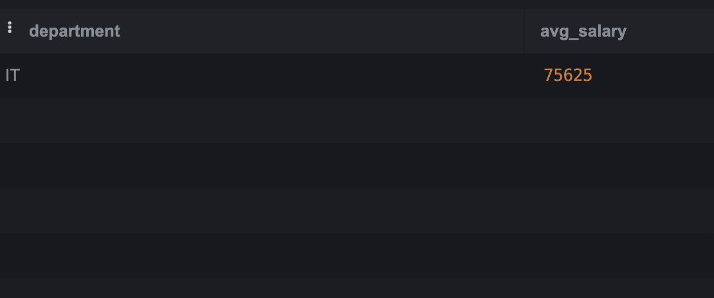
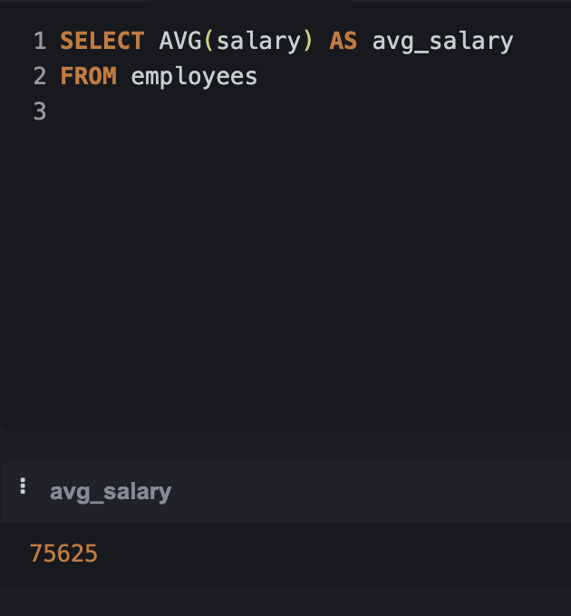
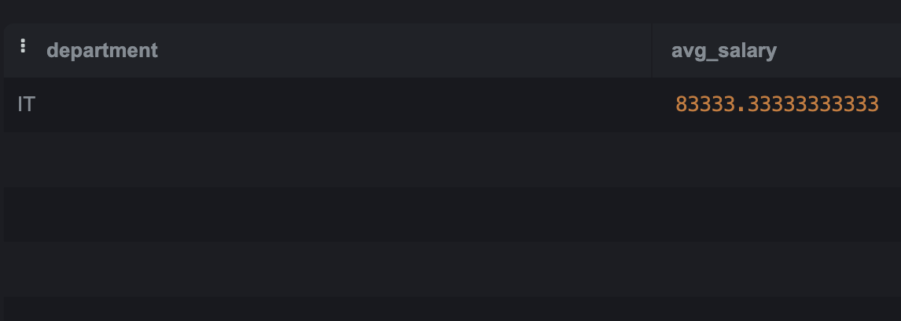

# SQL Crash Course for Interview Prep

Let me explain SQL from the ground up, focusing on what you need for the ByteDance test development interview.

## 1. SQL Basics: What Is SQL?

SQL (Structured Query Language) is a standard language for managing and manipulating relational databases. It lets you:
- Create, read, update, and delete data (CRUD operations)
- Create and modify database structures
- Set permissions on database objects

## 2. Key SQL Commands

### SELECT: Retrieving Data
```sql
SELECT column1, column2 FROM table_name;
```
- Get all columns: `SELECT * FROM table_name;`
- Get distinct values: `SELECT DISTINCT column FROM table_name;`

### WHERE: Filtering Data
```sql
SELECT * FROM employees WHERE department = 'IT';
```

Comparison operators:
- Equals: `=`
- Not equals: `<>` or `!=`
- Greater/Less than: `>`, `<`, `>=`, `<=`
- Between range: `BETWEEN 50000 AND 70000`
- In a list: `IN ('IT', 'HR')`
- Pattern matching: `LIKE 'J%'` (starts with J)
- NULL values: `IS NULL` or `IS NOT NULL`

### ORDER BY: Sorting Results
```sql
SELECT * FROM employees ORDER BY salary DESC;
```
- ASC (ascending, default)
- DESC (descending)

### LIMIT: Restricting Results
```sql
SELECT * FROM employees LIMIT 5;
```

### GROUP BY: Grouping Data
```sql
SELECT department, COUNT(*) FROM employees GROUP BY department;
```

### HAVING: Filtering Groups
```sql
SELECT department, AVG(salary) as avg_salary 
FROM employees 
GROUP BY department 
HAVING AVG(salary) > 70000;
```

## 3. Table Joins

Joins connect rows from different tables based on related columns.

### INNER JOIN
Returns only matching rows from both tables:
```sql
SELECT employees.name, departments.department_name
FROM employees
INNER JOIN departments ON employees.department_id = departments.id;
```

### LEFT JOIN
Returns all rows from the left table and matching rows from the right:
```sql
SELECT employees.name, departments.department_name
FROM employees
LEFT JOIN departments ON employees.department_id = departments.id;
```

### RIGHT JOIN
Returns all rows from the right table and matching rows from the left:
```sql
SELECT employees.name, departments.department_name
FROM employees
RIGHT JOIN departments ON employees.department_id = departments.id;
```

### FULL JOIN
Returns all rows when there's a match in either table:
```sql
SELECT employees.name, departments.department_name
FROM employees
FULL JOIN departments ON employees.department_id = departments.id;
```

## 4. Table Aliases - Explaining e1, e2

Table aliases are temporary names given to tables in a query. They:
- Make SQL easier to read
- Are required when joining a table to itself (self-join)

```sql
SELECT e1.name, e1.salary, e1.department
FROM employees e1
WHERE e1.salary > (
    SELECT AVG(e2.salary) 
    FROM employees e2 
    WHERE e2.department = e1.department
);
```

```bash
FOR EACH employee (e1) IN employees table:
    # Calculate the average salary in this employee's department
    dept_average = 0
    dept_employee_count = 0
    
    FOR EACH employee (e2) IN employees table:
        IF e2.department EQUALS e1.department THEN
            # This employee is in the same department as our current employee
            ADD e2.salary TO dept_total
            INCREMENT dept_employee_count
        END IF
    END FOR
    
    dept_average = dept_total / dept_employee_count
    
    # Check if current employee's salary exceeds their department average
    IF e1.salary > dept_average THEN
        ADD e1 TO results
    END IF
END FOR

RETURN results
```

In this example:
- `e1` is an alias for the first reference to the employees table
- `e2` is an alias for the second reference to the same table
- This lets us compare an employee's salary against the average in their department

## 5. Aggregate Functions

- COUNT(): Count rows
- SUM(): Total of values
- AVG(): Average of values
- MAX(): Maximum value
- MIN(): Minimum value

```sql
SELECT 
    department,
    COUNT(*) as employee_count,
    AVG(salary) as avg_salary,
    MAX(salary) as highest_salary,
    MIN(salary) as lowest_salary
FROM employees
GROUP BY department;
```

## 6. Subqueries

A query within another query:

```sql
SELECT name, salary
FROM employees
WHERE salary > (SELECT AVG(salary) FROM employees);
```

This finds employees with salary above company average.

## 7. Common Interview Problems

### Finding Duplicates
```sql
SELECT name, COUNT(*) as count
FROM employees
GROUP BY name
HAVING COUNT(*) > 1;
```

### Second Highest Salary
```sql
SELECT MAX(salary)
FROM employees
WHERE salary < (SELECT MAX(salary) FROM employees);
```

### Employees with Salary Above Department Average
```sql
SELECT e.name, e.department, e.salary
FROM employees e
WHERE salary > (
    SELECT AVG(salary)
    FROM employees
    WHERE department = e.department
);
```

## 8. Practice Exercise

Try writing a query to find the employee with the highest salary in each department. This is a common interview question that tests your understanding of grouping and subqueries.

Would you like me to provide more specific examples related to testing scenarios or any other SQL concepts you're curious about?


Let's practice with a hands-on exercise using our employees dataset. Here's a challenge for you:

**Challenge**: Write a SQL query that finds the department with the highest average salary and shows both the department name and the average salary value.

This is a good exercise because it tests:
1. Use of GROUP BY
2. Aggregate functions (AVG)
3. Ordering results
4. Limiting results

Try to write this query yourself, and then I can provide feedback and explain any parts that might be confusing.

```sql
select * from employees
```


```sql
SELECT department, AVG(salary) AS avg_salary
FROM employees
```


> The 75625 is actually the average salary of ALL employees, not just IT department




## The Key Rule
When using aggregate functions in a SELECT statement, every column in the SELECT list must either:
1. Be included in the GROUP BY clause, OR
2. Be inside an aggregate function

## Example to Illustrate
If we have this query:
```sql
SELECT department, AVG(salary) AS avg_salary
FROM employees
```


- `AVG(salary)` is an aggregate column (uses the AVG function)
- `department` is a non-aggregate column (just a regular column)

The database doesn't know which department to show with the average salary calculation because we're condensing multiple rows into one result row.

### The Solution: GROUP BY
```sql
SELECT department, AVG(salary) AS avg_salary
FROM employees
GROUP BY department
```

Now the database knows to:
1. Group all employees by their department
2. Calculate the average salary for each department group
3. Return one row per department group

## Error Prevention Rule
If you see an error like "misuse of aggregate" or "column must appear in GROUP BY clause", it means you have a non-aggregate column in your SELECT that isn't included in your GROUP BY clause.

```sql
SELECT department, AVG(salary) AS avg_salary
FROM employees
Group by department
order by avg_salary DESC
limit 1

```



I'd be happy to provide some SQL interview questions based on the employees dataset you shared. Here are some SQL questions that could be asked in interviews, ranging from basic to more advanced:

### Basic SQL Questions:

1. Write a query to find all employees in the IT department.
```sql
SELECT name
FROM employees
where department = 'IT'
```


2. How would you find the employee with the highest salary?

```sql
SELECT name, salary
FROM employees
order by salary DESC
limit 1
```
(should i not include the salary col, if so how to do)


3. Find the average salary for each department.

```sql
SELECT department, AVG(salary)
FROM employees
group by department
```


4. List all employees whose salary is above 70000.

```sql
SELECT name, salary
FROM employees
where salary>70000
```


5. Count the number of employees in each department.

```sql
select department, count(*) from employees
group by department
```

### Intermediate SQL Questions:

6. Find the department with the highest average salary.

```sql
select department, AVG(salary) as avg_salary from employees
group by department
order by avg_salary DESC
limit 1
```


7. List the employees in descending order of salary, but only show the top 3 highest-paid employees.

```sql
select name, salary from employees
order by salary DESC
limit 3
```


8. Calculate the difference between each employee's salary and the average salary of their department.

```

```


9. Find the second highest salary in the company.

10. Write a query to display the name, department, and salary of employees who earn more than the average salary in their department.

### Advanced SQL Questions:

11. Find departments that have more than 2 employees.

12. Calculate the running total of salaries ordered by employee ID.

13. Identify if there are any departments where all employees earn more than 70000.

14. For each employee, show their name, department, salary, and what percentage their salary is of the total salary budget.

15. Create a query that shows for each department: the department name, the number of employees, the minimum salary, the maximum salary, the average salary, and the total salary.
