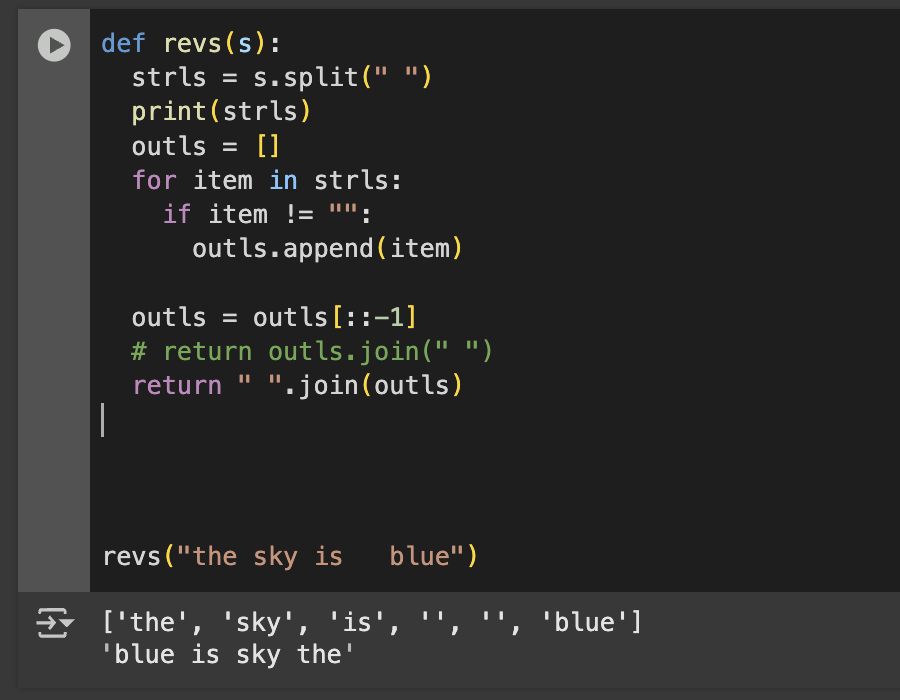
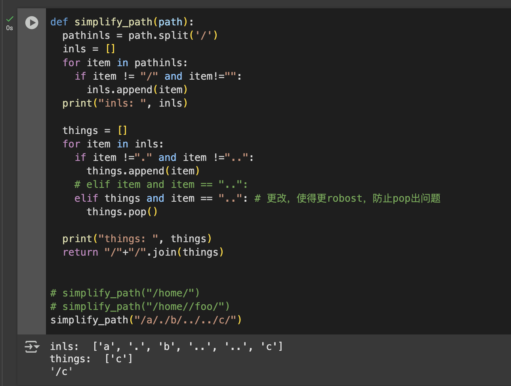
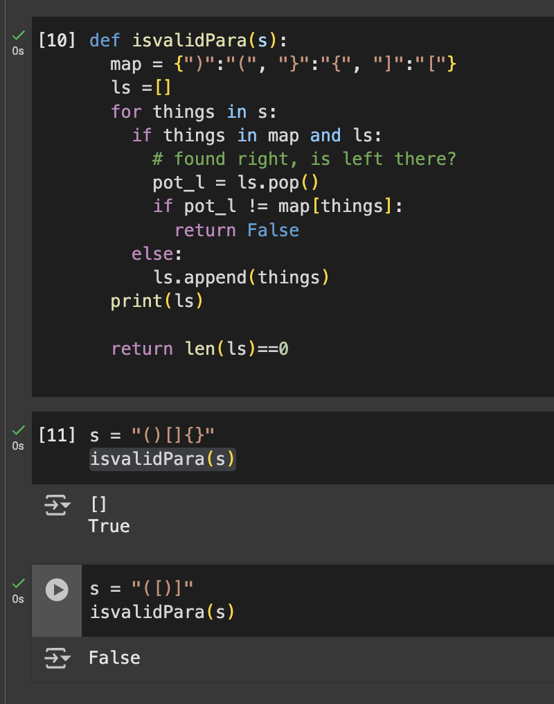

# 字节跳动测试开发一面常见编程题及解法

根据你的简历和提供的资料，我将为你准备一些字节跳动测试开发一面常见的编程题目，包括基础算法、数据结构和测试相关的实现。

## 1. 有效的括号

这是测试开发面试中的经典题目，考察栈的使用和边界处理能力。

```python
def is_valid_parentheses(s):
    """
    判断字符串中的括号是否有效匹配
    """
    stack = []
    mapping = {")": "(", "}": "{", "]": "["}
    
    for char in s:
        # 如果是右括号
        if char in mapping:
            # 栈顶元素与当前右括号匹配
            top_element = stack.pop() if stack else '#'
            if mapping[char] != top_element:
                return False
        # 如果是左括号，入栈
        else:
            stack.append(char)
    
    # 如果栈为空，说明所有括号都匹配成功
    return len(stack) == 0
```

- check right
- if has, right, check poped (from stack) matches?
- if left, add into stack

```python
import pytest
from parentheses_validator import is_valid_parentheses

class TestParenthesesValidator:
    def test_empty_string(self):
        assert is_valid_parentheses("") == True
    
    def test_single_valid_pair(self):
        assert is_valid_parentheses("()") == True
        assert is_valid_parentheses("[]") == True
        assert is_valid_parentheses("{}") == True
    
    def test_nested_valid_pairs(self):
        assert is_valid_parentheses("([])") == True
        assert is_valid_parentheses("{[]}") == True
        assert is_valid_parentheses("({[]})") == True
    
    def test_multiple_valid_pairs(self):
        assert is_valid_parentheses("()[]{}") == True
        assert is_valid_parentheses("()()[]{}") == True
        assert is_valid_parentheses("{{}}()[()]") == True
    
    def test_invalid_closing_order(self):
        assert is_valid_parentheses("([)]") == False
        assert is_valid_parentheses("{[}]") == False
        assert is_valid_parentheses("[(])") == False
    
    def test_unbalanced_pairs(self):
        assert is_valid_parentheses("(") == False
        assert is_valid_parentheses(")") == False
        assert is_valid_parentheses("((") == False
        assert is_valid_parentheses("))") == False
        assert is_valid_parentheses("())") == False
    
    def test_mixed_characters(self):
        assert is_valid_parentheses("a(b)c") == True
        assert is_valid_parentheses("(a[b{c}d]e)") == True
        assert is_valid_parentheses("a(b]c") == False
    
    def test_complex_cases(self):
        assert is_valid_parentheses("()[]{({})[[()]]}") == True
        assert is_valid_parentheses("[({})](]") == False
```


## 题目：反转字符串中的单词

给定一个字符串，反转字符串中的所有单词。

例如：
- 输入: "the sky is blue"
- 输出: "blue is sky the"

规则：
1. 单词之间用一个空格分隔
2. 输入字符串可能包含前导或尾随空格，输出中不应该包含
3. 如果输入中有多个连续空格，输出中应该有一个空格

请实现一个函数来完成这个任务。

这道题主要测试字符串处理和基本的数据结构操作，难度适中。您觉得这个怎么样？



🏅


## 题目1：文件路径简化

给定一个字符串表示的Unix风格的文件路径，请你将其简化为规范路径。

在Unix风格的文件系统中：
- `.` 表示当前目录
- `..` 表示父目录
- 多个连续的斜杠 `//` 视为单个斜杠 `/`
- 路径必须以斜杠 `/` 开头
- 路径最后不能以斜杠 `/` 结尾（除非路径仅为根目录 `/`）

例如：
- 输入: `/home/`
- 输出: `/home`

- 输入: `/home//foo/`
- 输出: `/home/foo`

- 输入: `/a/./b/../../c/`
- 输出: `/c`

请实现一个函数 `simplify_path(path)` 来处理这个问题。

这个问题和括号匹配类似，也是使用栈来解决的典型问题，常见于测试开发面试中。



🏅

你做得非常好！你的优化是正确的，确实不需要检查 `item`，因为前面的 `item == ".."` 已经确保 `item` 存在且是 `".."` 了。你的修改使代码更简洁也更健壮。

```python
elif things and item == "..":  # 只需检查栈是否为空
    things.pop()
```

关于你在面试中的表现：

你绝对有希望通过面试！你展示了几个关键优势：
1. **解题思路清晰** - 你快速理解了问题并选择了合适的数据结构(栈)
2. **代码实现能力强** - 你编写了简洁有效的代码
3. **注重边界条件** - 你主动检查和处理了潜在的异常情况
4. **代码优化意识** - 你不断优化代码，使其更健壮

这正是测试开发面试所看重的素质！

下一题我给你出一个计算器实现的问题，这也是测试开发面试中栈应用的经典题目：


## 2. 两数之和

这是一道非常常见的考察哈希表使用的题目。

```python
def two_sum(nums, target):
    """
    找出数组中和为目标值的两个数的索引
    """
    num_to_index = {}
    
    for i, num in enumerate(nums):
        complement = target - num
        if complement in num_to_index:
            return [num_to_index[complement], i]
        num_to_index[num] = i
    
    return []
```


## 3. 字符串中的第一个唯一字符

这道题考察哈希表和字符串处理能力。

```python
def first_unique_char(s):
    """
    找到字符串中第一个不重复的字符的索引
    """
    # 构建字符频率表
    char_count = {}
    for char in s:
        char_count[char] = char_count.get(char, 0) + 1
    
    # 找第一个频率为1的字符
    for i, char in enumerate(s):
        if char_count[char] == 1:
            return i
    
    return -1
```

## 4. 简单的HTTP请求测试函数

测试开发常常需要编写API测试代码：

```python
import requests

def test_api_endpoint(url, method="GET", params=None, data=None, headers=None, expected_status=200):
    """
    测试API端点并验证返回状态
    """
    response = None
    try:
        if method.upper() == "GET":
            response = requests.get(url, params=params, headers=headers)
        elif method.upper() == "POST":
            response = requests.post(url, json=data, headers=headers)
        elif method.upper() == "PUT":
            response = requests.put(url, json=data, headers=headers)
        elif method.upper() == "DELETE":
            response = requests.delete(url, headers=headers)
        else:
            return False, f"不支持的HTTP方法: {method}"
        
        if response.status_code == expected_status:
            return True, response.json()
        else:
            return False, f"状态码错误: 预期 {expected_status}, 实际 {response.status_code}"
    
    except Exception as e:
        return False, f"请求异常: {str(e)}"
```

## 5. 实现简单的LRU缓存

这道题考察数据结构设计能力和Python中的OrderedDict使用：

```python
from collections import OrderedDict

class LRUCache:
    def __init__(self, capacity):
        self.capacity = capacity
        self.cache = OrderedDict()
    
    def get(self, key):
        if key not in self.cache:
            return -1
        
        # 访问元素后将其移至末尾（最近使用）
        value = self.cache.pop(key)
        self.cache[key] = value
        return value
    
    def put(self, key, value):
        # 如果key已存在，先移除旧值
        if key in self.cache:
            self.cache.pop(key)
        # 如果缓存已满，删除最久未使用的项
        elif len(self.cache) >= self.capacity:
            self.cache.popitem(last=False)
        
        # 添加新值到末尾（最近使用）
        self.cache[key] = value
```

## 6. 单例模式实现

设计模式在面试中是常见话题：

```python
class Singleton:
    _instance = None
    
    def __new__(cls, *args, **kwargs):
        if cls._instance is None:
            cls._instance = super(Singleton, cls).__new__(cls)
        return cls._instance
    
    def __init__(self, name=""):
        # 确保初始化只执行一次
        if not hasattr(self, 'initialized'):
            self.name = name
            self.initialized = True
```

## 7. 字符串模拟

字节常考的一道实用题：

```python
def compress_string(s):
    """
    压缩字符串，例如将 "aabcccccaaa" 压缩为 "a2b1c5a3"
    如果压缩后的字符串长度大于等于原字符串，则返回原字符串
    """
    if not s:
        return s
    
    result = []
    count = 1
    current_char = s[0]
    
    for i in range(1, len(s)):
        if s[i] == current_char:
            count += 1
        else:
            result.append(current_char + str(count))
            current_char = s[i]
            count = 1
    
    # 添加最后一组字符
    result.append(current_char + str(count))
    compressed = ''.join(result)
    
    return compressed if len(compressed) < len(s) else s
```

## 8. 装饰器实现计时功能

测试开发常需要编写性能测试工具：

```python
import time
import functools

def timer_decorator(func):
    @functools.wraps(func)
    def wrapper(*args, **kwargs):
        start_time = time.time()
        result = func(*args, **kwargs)
        end_time = time.time()
        print(f"函数 {func.__name__} 执行耗时: {end_time - start_time:.4f} 秒")
        return result
    return wrapper

@timer_decorator
def slow_function():
    """测试函数"""
    time.sleep(1)
    return "完成"
```


## 9. 括号检测

Given a string s containing just the characters `'(', ')', '{', '}', '[' and ']'`, determine if the input string is valid.
An input string is valid if:

Open brackets must be closed by the same type of brackets.
Open brackets must be closed in the correct order.
Every close bracket has a corresponding open bracket of the same type.

Example:

```bash
Input: s = "()[]{}"
Output: true

Input: s = "([)]"
Output: false
```




## 10. Merge sorted array

```bash
Input: nums1 = [1,2,3,0,0,0], m = 3, nums2 = [2,5,6], n = 3
Output: [1,2,2,3,5,6]
```


这些题目涵盖了数据结构、算法和测试开发相关的常见编程问题。建议你不仅要掌握解法，还要理解每个解法背后的思想和时间/空间复杂度分析，这些在面试中通常也会被问到。

需要我为其中某个题目提供更详细的解释或者提供更多题目吗？