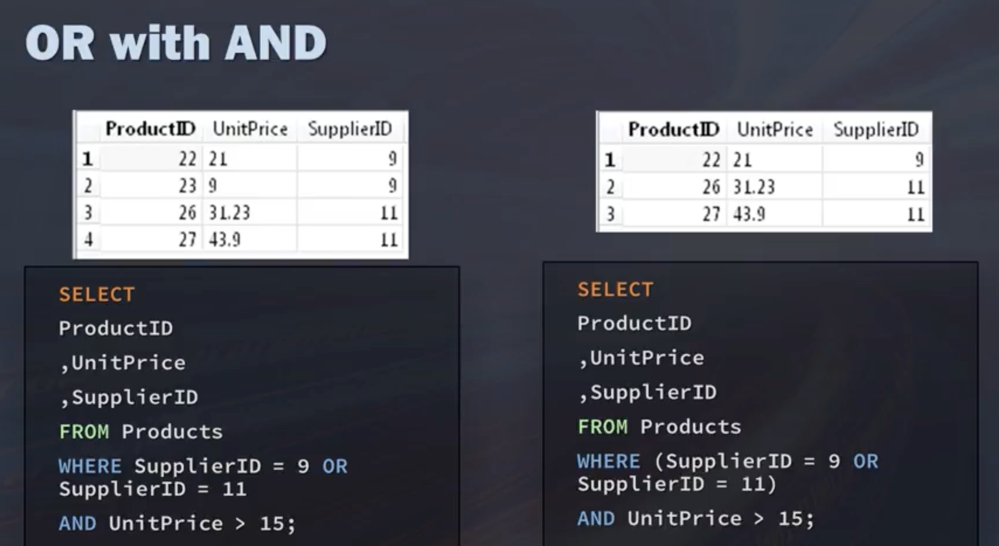

### Past interview question:

给一个id，科目；成绩的表，搜索不及格科目大于两门课的学生id。

我一开始：
```sql
select id, subject, score 
from student_scores
where count(score < 60)>2
```

改
```sql
select id
from student_scores
where score<60
group by id
having count(*) > 2

```


### Basic SQL Questions:

1. Write a query to find all employees in the IT department.
```sql
SELECT name
FROM employees
where department = 'IT'
```


2. How would you find the employee with the highest salary?

```sql
SELECT name, salary
FROM employees
order by salary DESC
limit 1
```
(should i not include the salary col, if so how to do)


3. Find the average salary for each department.

```sql
SELECT department, AVG(salary)
FROM employees
group by department
```


4. List all employees whose salary is above 70000.

```sql
SELECT name, salary
FROM employees
where salary>70000
```


5. Count the number of employees in each department.

```sql
select department, count(*) from employees
group by department
```

### Intermediate SQL Questions:

6. Find the department with the highest average salary.

```sql
select department, AVG(salary) as avg_salary from employees
group by department
order by avg_salary DESC
limit 1
```


7. List the employees in descending order of salary, but only show the top 3 highest-paid employees.

```sql
select name, salary from employees
order by salary DESC
limit 3
```


8. Calculate the difference between each employee's salary and the average salary of their department.

- calculate avg of each department
- find diff between each employee;s salary and avg in their department

```sql
select name as employee,
    salary,
    department,
    ABS(salary - (SELECT AVG(salary) FROM employees3 e2 WHERE e2.department = e1.department)) AS salary_difference
from employees3 e1
order by salary_difference desc

```


9. Find the second highest salary in the company.

```sql
SELECT name, salary
FROM employees3 e1
WHERE e1.salary = (
    SELECT MAX(e2.salary)
    FROM employees3 e2
    WHERE e2.salary < (SELECT MAX(e3.salary) FROM employees3 e3)
)

```

or

```sql
SELECT name, salary
FROM employees3
ORDER BY salary DESC
LIMIT 1 OFFSET 1
```


9.5. median?

```sql
SELECT name, salary
FROM employees3
ORDER BY salary
LIMIT 1
OFFSET ((SELECT COUNT(*) FROM employees3) - 1) / 2
```

10. Write a query to display the name, department, and salary of employees who earn more than the average salary in their department.


```sql
select name, department, salary
from employees3 e1
where salary > (
  select AVG(salary) 
  from employees3 e2 
  where e1.department = e2.department
)
Order by department,salary desc
```


### Advanced SQL Questions:

11. Find departments that have more than 2 employees.


12. Calculate the running total of salaries ordered by employee ID.

13. Identify if there are any departments where all employees earn more than 70000.

14. For each employee, show their name, department, salary, and what percentage their salary is of the total salary budget.

15. Create a query that shows for each department: the department name, the number of employees, the minimum salary, the maximum salary, the average salary, and the total salary.




