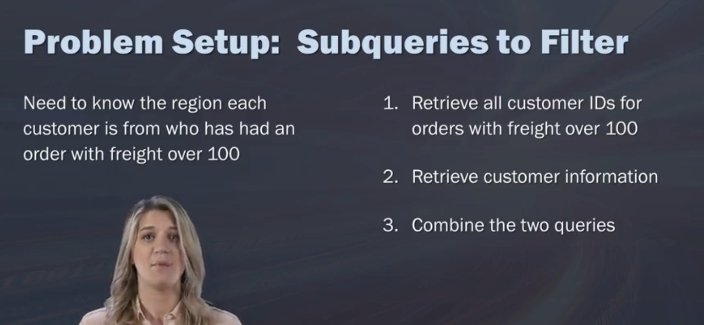
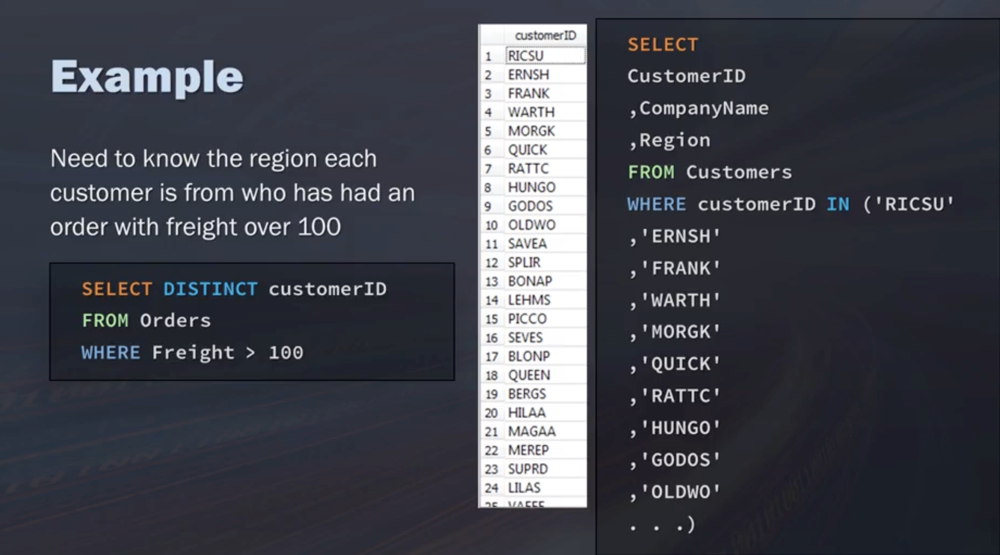
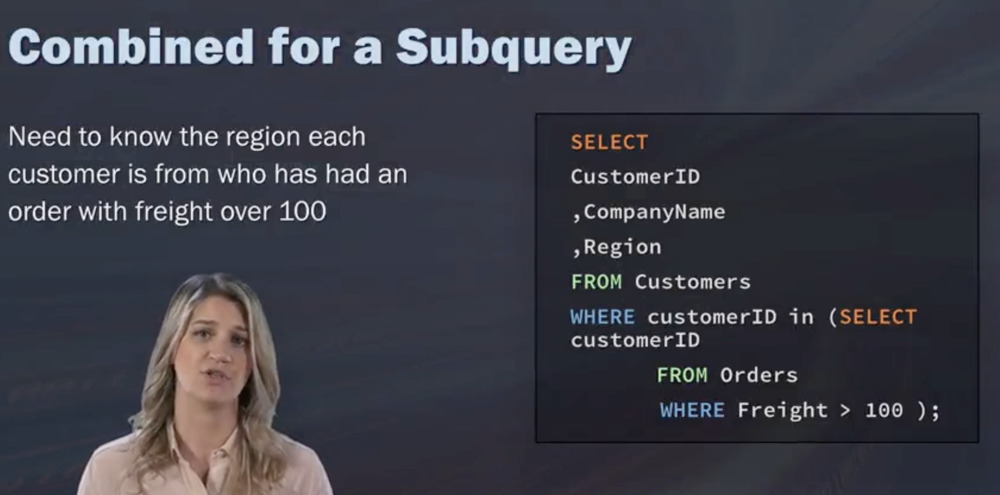
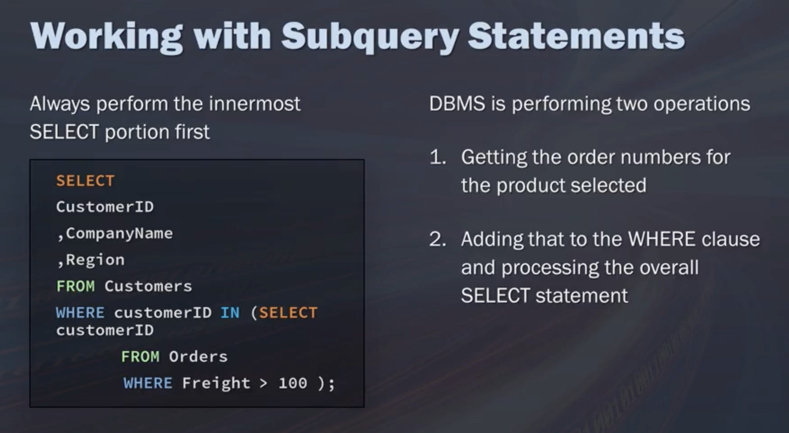
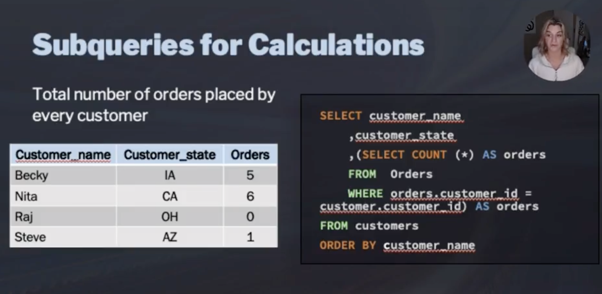
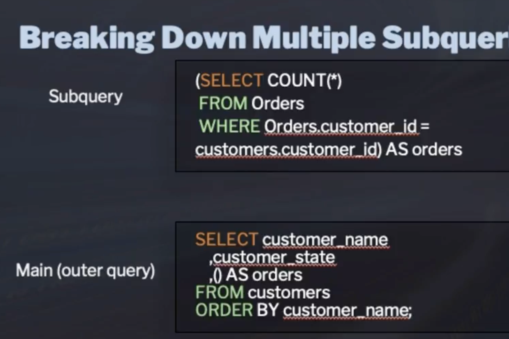
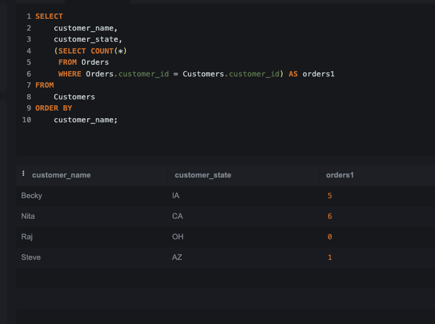

## subqueries!!!!

region for:
- each customer
    - who had an order with freight over 100

= 

all customer IDs for order with freight over 100
customer information (region)
combine

start from inner most 
(start from the most complex one)

query will process the inner most first as well

### subqueries for calculations

this is fine too 

